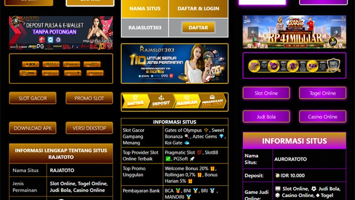
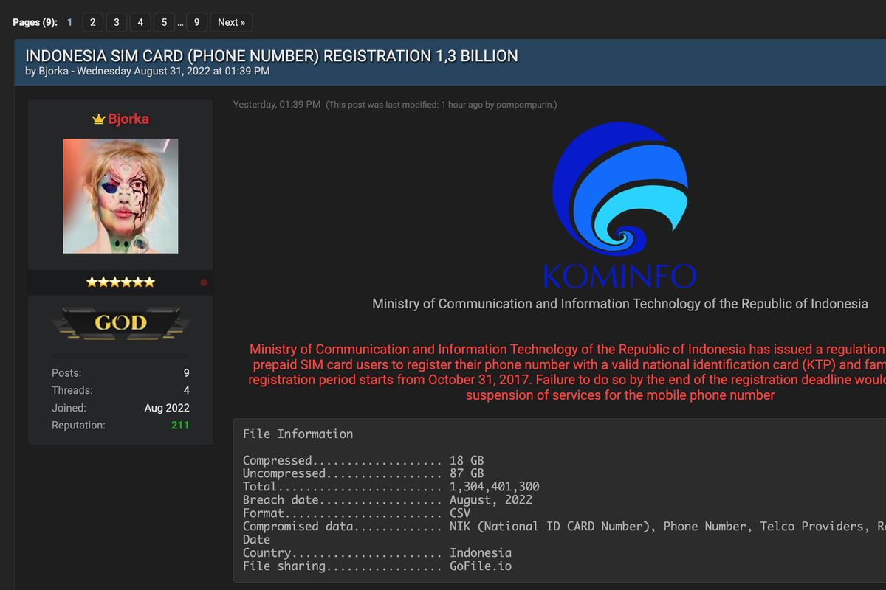
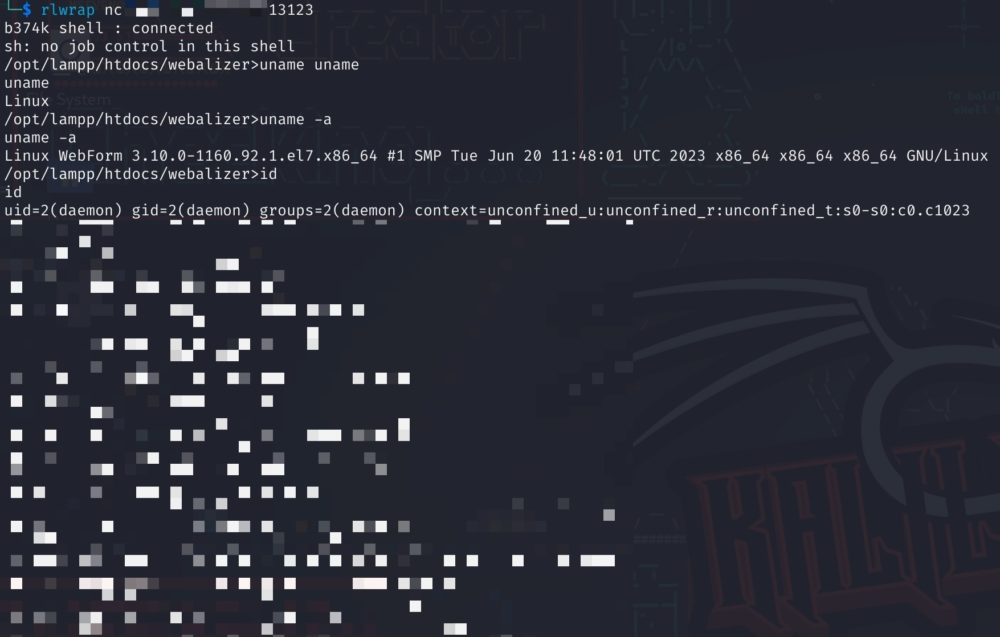
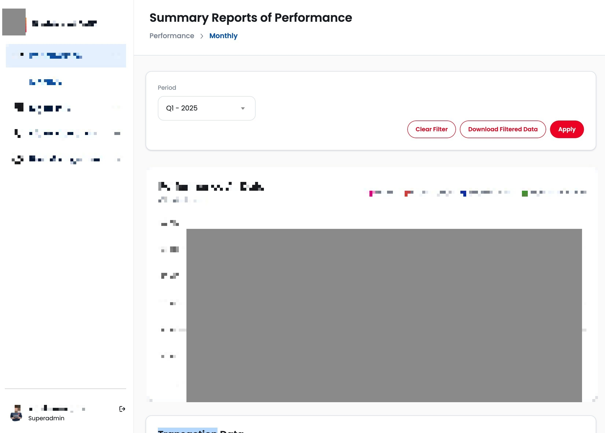

# Closer than you think
### Noverdi A Ramadhan

---

## 4 Years Ago → Today

**2021**: Cosmos organizer
❌ "Security" was just using a strong password

**2025**: Cybersecurity consultant
✅ Help companies avoid breaches

---

## My first security finding?

One line of bad code in our university website could have shut down the entire campus

---

The same mistakes I made as a freshman, are the same mistakes that cost companies millions today

---

---

## XSS: The Page Hijacker

Websites become fake gambling sites. Student's university account taken over.

---

---

## SQLi: The Data Thief

Steals data and personal information. 100,000+ customers' personal data exposed.

---

---

## LFI: The Safe Cracker

Steals company secrets and passwords. Got access to campus' private database.

---

---

## JWT: The Identity Thief

Pretends to be anyone inside the system. Became the super admin in 5 minutes.

---

## Your Turn: COSMOS Labs

`localhost:8080`

---

## Lab Time!

Find bugs, learn defense. I'll give hints, answers, explanations

Think like attacker → Code like defender

---

## Remember

4 years ago: I made these mistakes
Today: I find them for a living
You: Learning them NOW

**Security = Being better than yesterday**

---

# Questions?

**The best time to learn security was yesterday.**
**The second best time is NOW.** 🚀